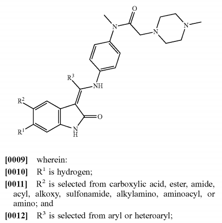

# Multimodal Markush Structure Parsing

This module implements the multimodal Markush information extraction workflow described in the paper (Figure 9). It combines three components to parse complete Markush structures from document images:

1. **MinerU** — Layout analysis and OCR to separate the graphical scaffold from accompanying textual definitions
2. **CLIP-OCSR** — Backbone pseudo-SMILES generation from the cropped structure image
3. **LLM** — Structured variable definition extraction from OCR-derived text

The two outputs are combined to form a structured Markush representation that preserves both the graphical backbone information and the text-defined variable constraints.

## Prerequisites

- Python 3.12
- CLIP-OCSR Stage 1 and Stage 2 checkpoints (see main [README](../README.md) for download instructions)
- [MinerU](https://github.com/opendatalab/MinerU) installed locally (see below)
- An OpenAI-compatible LLM API key (e.g., DeepSeek, MiMo)

## Installation

Install CLIP-OCSR first (see main [README](../README.md#installation)), then install additional dependencies for Markush parsing:

```bash
pip install openai python-dotenv
```

### Local MinerU Setup

MinerU is used for document layout analysis. Install it in a separate conda environment:

```bash
conda create -n mineru-3.4-pipeline python=3.12 -y
conda activate mineru-3.4-pipeline
pip install "mineru[pipeline]==3.4.0"
```

Verify the installation:

```bash
mineru --version
```

For more details, see the [MinerU GitHub repository](https://github.com/opendatalab/MinerU).

### Download MinerU Models

After installation, download the pipeline models:

```bash
export MINERU_MODEL_SOURCE=modelscope   # Use ModelScope for servers in China
mineru-models-download
```

In the interactive menu, select only **pipeline** related models. After download:

```bash
export MINERU_MODEL_SOURCE=local
```

**Note**: `export MINERU_MODEL_SOURCE=local` must be re-run every time you log in. Consider adding it to your shell profile or conda activation script.

## Configuration

Copy the example environment file and fill in your credentials:

```bash
cp markush_parsing/.env.example markush_parsing/.env
```

Edit `.env` with your settings:

```bash
# Model paths
STAGE1_CKPT_PATH=/path/to/stage1_clip_checkpoint.pt
STAGE2_CKPT_PATH=/path/to/stage2_ocsr_checkpoint.pt

# Local MinerU output directory
MINERU_OUTPUT_DIR=/path/to/mineru_outputs

# LLM API (choose one)
DEEPSEEK_API_KEY=your_api_key_here
DEEPSEEK_BASE_URL=https://api.deepseek.com/v1
DEEPSEEK_MODEL=deepseek-v4-flash
```

## Evaluation Data

The file `Complete_Markush_Representation.csv` contains source metadata for the 27 Markush descriptions (21 patent-derived, 6 journal-derived) used to evaluate the multimodal parsing workflow in the paper.

## MinerU Pre-computation

Before running the pipeline, you must pre-compute MinerU layout outputs. This is a one-time step per dataset:

```bash
conda activate mineru-3.4-pipeline
mineru -p /path/to/images -o /path/to/mineru_outputs -b pipeline
```

This creates a directory structure like:
```
mineru_outputs/
  markush_representation_01/
    auto/
      markush_representation_01_content_list.json
      images/
        ...
```

## Usage

### Run on a single image

```bash
python markush_parsing/run.py --input assets/markush_representation_example.png --mineru-dir /path/to/mineru_outputs --output results/ --llm deepseek
```

Example input ([`assets/markush_representation_example.png`](../assets/markush_representation_example.png)):



### Run on a folder of images with evaluation labels

```bash
python markush_parsing/run.py \
    --input /path/to/images \
    --labels labels.json \
    --mineru-dir /path/to/mineru_outputs \
    --output results/ \
    --llm deepseek
```

### Evaluate saved results

```bash
python markush_parsing/run.py --evaluate results/deepseek/per_sample.jsonl
```

### Test MinerU layout analysis only

```bash
python markush_parsing/run.py --input image.png --mineru-dir /path/to/mineru_outputs --crop --output results/
```

## Evaluation Metrics

| Metric | Description |
|--------|-------------|
| Markush Graphical Accuracy | Exact match accuracy |
| Variable Recall | Fraction of ground-truth substituents correctly predicted |
| Variable Precision | Fraction of predicted substituents that match ground truth |
| Variable F1 | Harmonic mean of recall and precision |

## Pipeline Architecture

```
Input Image
    |
    v
[MinerU] Layout analysis + OCR
    |                           |
    v                           v
Structure crop              OCR text
    |                           |
    v                           v
[CLIP-OCSR]                 [LLM]
Pseudo-SMILES               Variable definitions
    |                           |
    +---------------------------+
    |
    v
Structured Markush Representation
```

## Citation

If you use this module, please cite:

```bibtex
@article{clip_ocsr,
  title={Bridging the Markush Gap in Optical Chemical Structure Recognition via a CLIP-Derived Visual Backbone and Synthetic Data Generation},
  author={...},
  journal={...},
  year={2026}
}
```
