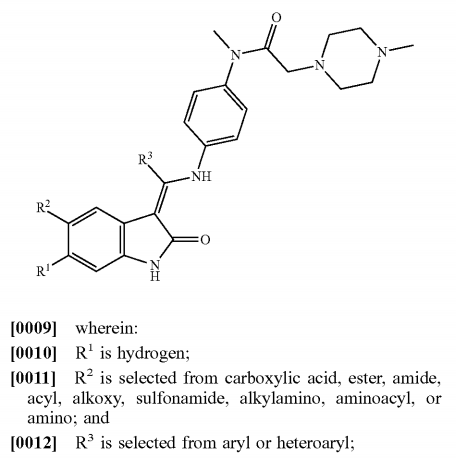

# Multimodal Markush Structure Parsing

This module implements the multimodal Markush information extraction workflow described in the paper (Figure 9). It combines three components to parse complete Markush structures from document images:

1. **MinerU** — Layout analysis and OCR to separate the graphical scaffold from accompanying textual definitions
2. **CLIP-OCSR** — Backbone pseudo-SMILES generation from the cropped structure image
3. **LLM** — Structured variable definition extraction from OCR-derived text
4. **Optional instantiation** — RDKit-based combination of the pseudo-SMILES and variable definitions into concrete molecular SMILES

The two recognition outputs form a structured Markush representation that
preserves both the graphical backbone and text-defined constraints. When
requested, a separate post-processing stage enumerates validated concrete
molecules without changing the recognition or evaluation results.

## Prerequisites

- Python 3.12
- CLIP-OCSR Stage 1 and Stage 2 checkpoints (see main [README](../README.md) for download instructions)
- [MinerU](https://github.com/opendatalab/MinerU) installed locally (see below)
- An OpenAI-compatible LLM API key (e.g., DeepSeek, MiMo)

## Installation

Install CLIP-OCSR first (see main [README](../README.md#installation)), then install additional dependencies for Markush parsing:

```bash
pip install openai python-dotenv
```

### Local MinerU Setup

MinerU is used for document layout analysis. Install it in a separate conda environment:

```bash
conda create -n mineru-3.4-pipeline python=3.12 -y
conda activate mineru-3.4-pipeline
pip install "mineru[pipeline]==3.4.0"
```

Verify the installation:

```bash
mineru --version
```

For more details, see the [MinerU GitHub repository](https://github.com/opendatalab/MinerU).

### Download MinerU Models

After installation, download the pipeline models:

```bash
export MINERU_MODEL_SOURCE=modelscope   # Use ModelScope for servers in China
mineru-models-download
```

In the interactive menu, select only **pipeline** related models. After download:

```bash
export MINERU_MODEL_SOURCE=local
```

**Note**: `export MINERU_MODEL_SOURCE=local` must be re-run every time you log in. Consider adding it to your shell profile or conda activation script.

## Configuration

Copy the example environment file and fill in your credentials:

```bash
cp markush_parsing/.env.example markush_parsing/.env
```

Edit `.env` with your settings:

```bash
# Model paths
STAGE1_CKPT_PATH=/path/to/stage1_clip_checkpoint.pt
STAGE2_CKPT_PATH=/path/to/stage2_ocsr_checkpoint.pt

# Local MinerU output directory
MINERU_OUTPUT_DIR=/path/to/mineru_outputs

# LLM API (choose one)
DEEPSEEK_API_KEY=your_api_key_here
DEEPSEEK_BASE_URL=https://api.deepseek.com/v1
DEEPSEEK_MODEL=deepseek-v4-flash
```

## Evaluation Data

The file `Complete_Markush_Representation.csv` contains source metadata for all
54 Markush images used to evaluate the multimodal parsing workflow in the
paper. It records provenance rather than ground-truth structures; evaluation
labels are supplied separately with `--labels`.

The evaluator accepts the original JSON label format and the reviewed M2S CSV
format. M2S graphical labels may be combined with its variable labels:

```bash
python markush_parsing/run.py \
    --input /path/to/m2s/images \
    --labels /path/to/pseudo_smiles_labels_m2s_reviewed_labels.csv \
    --variable-labels /path/to/labels.json \
    --mineru-dir /path/to/mineru_outputs \
    --output results/ \
    --llm deepseek
```

For position-variable structures, the reviewed CSV field
`final_pseudo_smiles_all` supplies the complete allowed pseudo-SMILES set.

## MinerU Pre-computation

Before running the pipeline, you must pre-compute MinerU layout outputs. This is a one-time step per dataset:

```bash
conda activate mineru-3.4-pipeline
mineru -p /path/to/images -o /path/to/mineru_outputs -b pipeline
```

This creates a directory structure like:
```
mineru_outputs/
  markush_representation_01/
    auto/
      markush_representation_01_content_list.json
      images/
        ...
```

## Usage

### Run on a single image

```bash
python markush_parsing/run.py --input assets/markush_representation_example.png --mineru-dir /path/to/mineru_outputs --output results/ --llm deepseek
```

Example input ([`assets/markush_representation_example.png`](../assets/markush_representation_example.png)):



### Run on a folder of images with evaluation labels

```bash
python markush_parsing/run.py \
    --input /path/to/images \
    --labels labels.json \
    --mineru-dir /path/to/mineru_outputs \
    --output results/ \
    --llm deepseek
```

### Generate concrete molecular SMILES

Add `--instantiate` to combine each predicted backbone pseudo-SMILES with its
extracted variable definitions:

```bash
python markush_parsing/run.py \
    --input /path/to/images \
    --mineru-dir /path/to/mineru_outputs \
    --output results/ \
    --llm deepseek \
    --instantiate
```

For finitely resolved definitions, concrete structures are exhaustively
enumerated by default; there is no implicit product-count cap. Each image
directory receives a plain-text file containing one unique canonical isomeric
SMILES per line:

```text
results/<provider>/<image-stem>/
  result.json
  concrete_smiles.txt
  concrete_smiles_audit.jsonl   # written automatically for smaller spaces
```

Before final fragment assignment, the program calculates the theoretical
Cartesian-product count. With the default `--audit-mode auto`, detailed
per-product audit JSONL is written when that count is at most 10,000. Above
that threshold, all unique SMILES are still generated, but only the SMILES
text file and lightweight result summary are retained. The threshold controls
audit size, not chemical-space enumeration.

The policy can be overridden explicitly:

```bash
# Always retain detailed per-product provenance
python markush_parsing/run.py ... --instantiate --audit-mode always

# Never retain detailed per-product provenance
python markush_parsing/run.py ... --instantiate --audit-mode never

# Change the automatic detailed-audit threshold
python markush_parsing/run.py ... --instantiate --audit-threshold 50000

# Deliberately stop after one million unique products
python markush_parsing/run.py ... --instantiate --max-products 1000000
```

`--max-products` is optional. If supplied and reached, the result is marked
`truncated` and `partial`; without it, every planned finite assignment is
attempted. Chemical interpretation (`complete`/`partial`/`failed`) is reported
separately from `enumeration_complete`. Thus an inferred `[R1$]` host-ring
expansion can be fully enumerated while remaining chemically `partial`.

To process an existing result without rerunning MinerU, OCSR, or the LLM:

```bash
python markush_parsing/run.py \
    --instantiate-results /path/to/per_sample.jsonl \
    --instantiation-output /path/to/instantiated_manifest.jsonl \
    --instantiation-products-dir /path/to/instantiated_products
```

This produces a lightweight per-sample manifest, a run summary, and one
`*_smiles.txt` file per sample. Detailed `*_audit.jsonl` files follow the same
audit policy. Product and audit lines are streamed; only canonical SMILES keys
needed for exact deduplication are retained in memory.

The fragment mapping used by default is bundled under
`markush_parsing/resources/`; no other repository or private data path is
required. See [MARKUSH_INSTANTIATION.md](MARKUSH_INSTANTIATION.md) for the
theoretical-count definition, two-stage deduplication, exact output schemas,
audit decision table, completeness semantics, position-variation boundary,
large-output considerations, and Python API.

### Evaluate saved results

```bash
python markush_parsing/run.py --evaluate results/deepseek/per_sample.jsonl
```

### Test MinerU layout analysis only

```bash
python markush_parsing/run.py --input image.png --mineru-dir /path/to/mineru_outputs --crop --output results/
```

## Evaluation Metrics

| Metric | Description |
|--------|-------------|
| Markush Graphical Accuracy | Exact match accuracy |
| Variable Recall | Fraction of ground-truth substituents correctly predicted |
| Variable Precision | Fraction of predicted substituents that match ground truth |
| Variable F1 | Harmonic mean of dataset macro Precision and macro Recall (MarkushGrapher-2 definition) |

All dataset samples remain in the primary denominator. Pipeline failures,
missing predictions, and empty/unscored results receive zero scores. Standalone
integer ranges such as `1-50` are expanded before variable scoring, matching
MarkushGrapher-2; chemical expressions such as `C1-C6 alkyl` are left intact.

For clarity, the aggregate output contains only the MarkushGrapher-2 F1. It is
saved as both `variable_f1` and the explicit alias
`variable_f1_from_macro_precision_recall`; the former mean-per-sample F1 field
is no longer reported.

## Pipeline Architecture

```
Input Image
    |
    v
[MinerU] Layout analysis + OCR
    |                           |
    v                           v
Structure crop              OCR text
    |                           |
    v                           v
[CLIP-OCSR]                 [LLM]
Pseudo-SMILES               Variable definitions
    |                           |
    +---------------------------+
    |
    v
Structured Markush Representation
    |
    v (optional)
[RDKit graph instantiation]
Concrete molecular SMILES
```

## Citation

If you use this module, please cite:

```bibtex
@article{clip_ocsr,
  title={Bridging the Markush Gap in Optical Chemical Structure Recognition via a CLIP-Derived Visual Backbone and Synthetic Data Generation},
  author={...},
  journal={...},
  year={2026}
}
```
